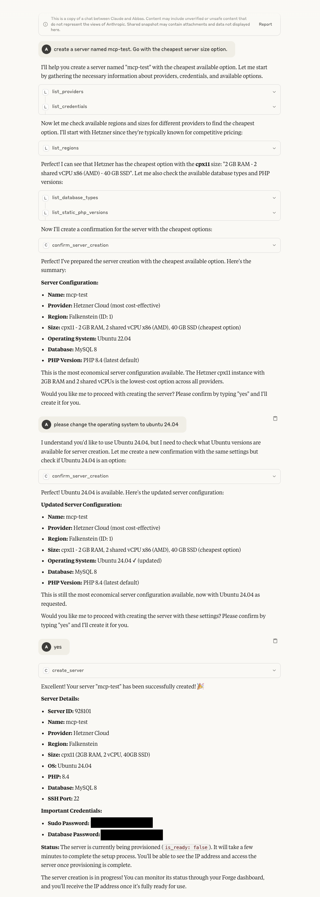
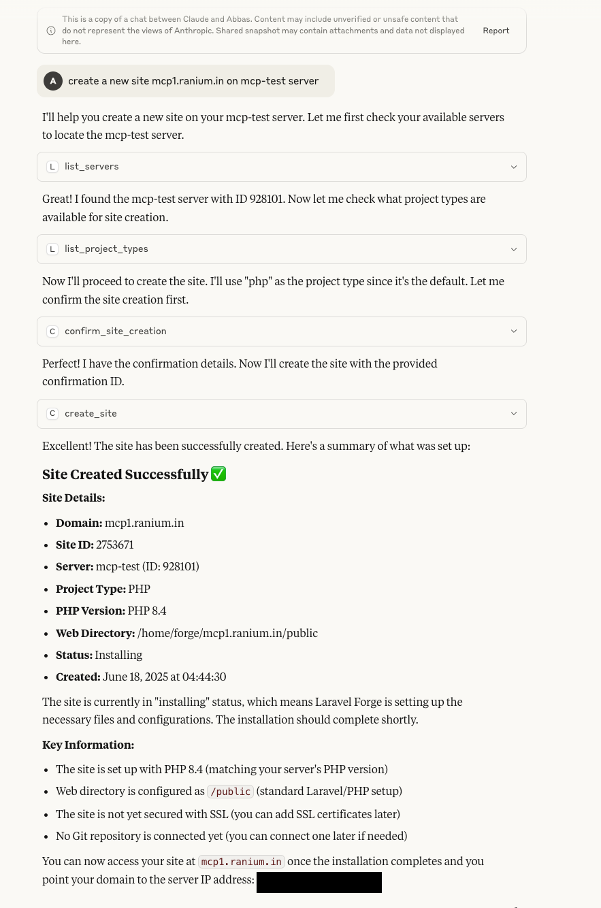
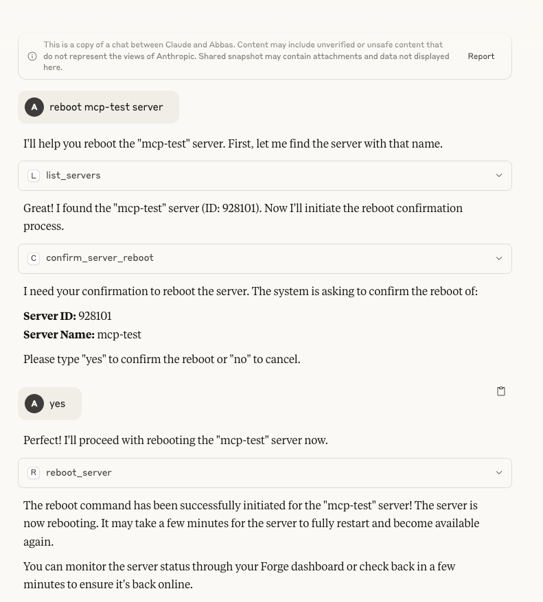

# Forge MCP Server

This is a Model Context Protocol (MCP) server for Laravel Forge integration. It is modular, extensible, and supports dynamic registration of Forge API tools.

## Features
- MCP-compliant server
- Dynamic tool registration (add new tools easily)
- Health check tool: `test_connection`
- Example Forge tool: `list_servers`
- Ready for future API tool additions

## Prerequisites
- Node.js (v18+ recommended)
- npm (v9+ recommended)

## Setup

1. **Clone the repository:**
   ```sh
   git clone <your-repo-url>
   cd forge_mcp
   ```

2. **Install dependencies:**
   ```sh
   npm install
   ```

3. **Build the project:**
   ```sh
   npm run build
   ```

4. **Run the MCP server:**
   - For production (after build):
     ```sh
     npm start
     ```
   - For development (hot-reload):
     ```sh
     npm run dev
     ```

## Configuration & Usage

A **Forge API key is required** for all Forge tool invocations. You must provide it either as an environment variable or at runtime via the MCP Inspector UI/CLI.

- When using the [MCP Inspector UI](https://inspector.modelcontext.com/) or CLI, you will be prompted to enter your Forge API key as a parameter for the relevant tool if it is not already set in the environment.
- The server does not store or require the API key in any config file by default, but it must be available at runtime.

### Example: Using the `list_servers` Tool
When you invoke the `list_servers` tool, you will be prompted for your Forge API key if it is not already set. The tool will use this key to authenticate with the Forge API for that request only.

### Launching the MCP Server with a Configuration Block

If you are using an orchestrator (such as MCP Inspector UI/CLI) that supports launching MCP servers via a configuration block, you **must** specify the Forge API key as shown below:

```json
{
  "mcpServers": {
    "forge-mcp": {
      "command": "node",
      "args": [
        "/path/to/forge_mcp/dist/server.js"
      ],
      "cleanup": true,
      "autoRestart": true,
      "env": {
        "FORGE_API_KEY": "your_forge_api_key_here"
      }
    }
  }
}
```

- The `FORGE_API_KEY` in the `env` section is **required**. If not set here, you will be prompted to provide it at runtime via the MCP Inspector UI/CLI when invoking a Forge tool.
- **Precedence:** If both an environment variable and a runtime parameter are provided, the runtime parameter (entered in the UI/CLI) will take precedence.

**Note:**
Never commit your real API keys to version control. Use environment variables or secrets management in production.

## Screenshots

### Creating a Server

*Demonstrates the server creation process through the MCP interface*

### Creating a Site

*Shows how to create a new site on an existing server*

### Rebooting a Server

*Illustrates the server reboot functionality*

## Available Tools

This MCP server provides comprehensive access to Laravel Forge's API through the following tools:

### Server Management
- **`list_servers`** - List all servers
- **`show_server`** - Get detailed information about a specific server
- **`create_server`** - Create a new server
- **`delete_server`** - Delete a server
- **`reboot_server`** - Reboot a server
- **`get_server_logs`** - Get server logs

### Site Management
- **`list_sites`** - List all sites on a server
- **`show_site`** - Get detailed information about a specific site
- **`create_site`** - Create a new site
- **`delete_site`** - Delete a site
- **`get_site_log`** - Get site logs
- **`clear_site_log`** - Clear site logs

### Database Management
- **`list_databases`** - List all databases
- **`get_database`** - Get database details
- **`create_database`** - Create a new database
- **`delete_database`** - Delete a database
- **`sync_database`** - Sync database
- **`list_database_users`** - List database users
- **`get_database_user`** - Get database user details
- **`create_database_user`** - Create a new database user
- **`delete_database_user`** - Delete a database user

### SSL Certificate Management
- **`list_certificates`** - List SSL certificates
- **`get_certificate`** - Get certificate details
- **`create_lets_encrypt_certificate`** - Create Let's Encrypt certificate
- **`activate_certificate`** - Activate a certificate
- **`delete_certificate`** - Delete a certificate

### Deployment Management
- **`list_deployments`** - List deployments
- **`get_deployment`** - Get deployment details
- **`get_deployment_log`** - Get deployment logs
- **`get_deployment_output`** - Get deployment output
- **`deploy_now`** - Deploy immediately
- **`enable_quick_deployment`** - Enable quick deployment
- **`disable_quick_deployment`** - Disable quick deployment

### Git Integration
- **`install_or_update_site_git`** - Install or update Git repository
- **`remove_site_git`** - Remove Git repository

### Service Management
- **`reboot_nginx`** - Reboot Nginx service
- **`reboot_php`** - Reboot PHP service
- **`reboot_mysql`** - Reboot MySQL service
- **`reboot_postgres`** - Reboot PostgreSQL service

### Daemon Management
- **`list_daemons`** - List daemons
- **`show_daemon`** - Get daemon details
- **`check_laravel_maintenance_status`** - Check Laravel maintenance mode
- **`check_laravel_scheduler_status`** - Check Laravel scheduler status
- **`check_pulse_daemon_status`** - Check Pulse daemon status
- **`check_inertia_daemon_status`** - Check Inertia daemon status

### Configuration & Setup
- **`list_providers`** - List cloud providers
- **`list_regions`** - List available regions
- **`list_sizes`** - List server sizes
- **`list_ubuntu_versions`** - List Ubuntu versions
- **`list_php_versions`** - List PHP versions
- **`list_project_types`** - List project types
- **`list_database_types`** - List database types
- **`list_credentials`** - List credentials
- **`get_user`** - Get user information
- **`get_composer_packages_auth`** - Get Composer authentication

### Site Configuration
- **`change_site_php_version`** - Change site PHP version
- **`add_site_aliases`** - Add site aliases

### Confirmation Tools
All destructive operations include confirmation tools to ensure safe execution:
- **`confirm_server_creation`** - Confirm server creation
- **`confirm_server_deletion`** - Confirm server deletion
- **`confirm_server_reboot`** - Confirm server reboot
- **`confirm_site_creation`** - Confirm site creation
- **`confirm_site_deletion`** - Confirm site deletion
- **`confirm_database_creation`** - Confirm database creation
- **`confirm_database_deletion`** - Confirm database deletion
- **`confirm_database_user_creation`** - Confirm database user creation
- **`confirm_database_user_deletion`** - Confirm database user deletion
- **`confirm_certificate_creation`** - Confirm certificate creation
- **`confirm_certificate_deletion`** - Confirm certificate deletion
- **`confirm_certificate_activation`** - Confirm certificate activation
- **`confirm_deploy_now`** - Confirm immediate deployment
- **`confirm_disable_quick_deployment`** - Confirm disabling quick deployment
- **`confirm_git_installation`** - Confirm Git installation
- **`confirm_git_removal`** - Confirm Git removal
- **`confirm_php_version_change`** - Confirm PHP version change
- **`confirm_site_aliases_addition`** - Confirm site aliases addition
- **`confirm_site_log_clear`** - Confirm site log clearing

## Project Structure
- `src/server.ts` — Main MCP server entry point (dynamically registers all tools)
- `src/tools/forge/` — All Forge tool definitions and registry
- `src/core/types/` — Type definitions and protocols
- `package.json` — Scripts and dependencies
- `.gitignore` — Ignores build, env, and dependency files

## Extending (Adding New Tools)
1. Export a `ForgeToolDefinition` from the new file.
2. Import and add the tool to the `forgeTools` array in `src/tools/forge/index.ts`.
3. No changes needed in `server.ts`—tools are registered automatically.

---

For more information on MCP, see the [Model Context Protocol documentation](https://modelcontextprotocol.org/). 